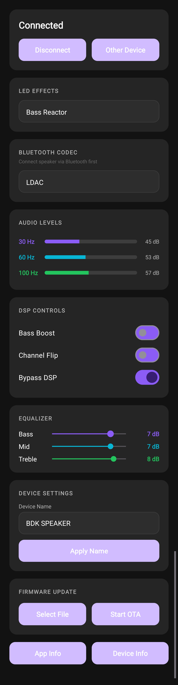
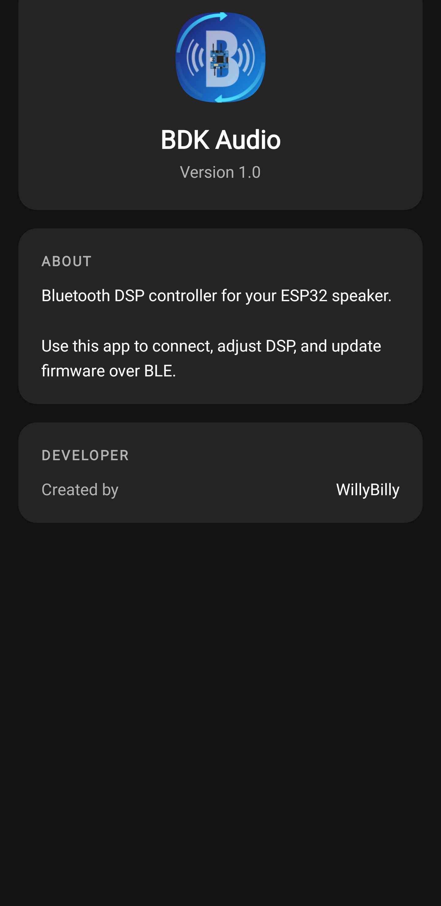
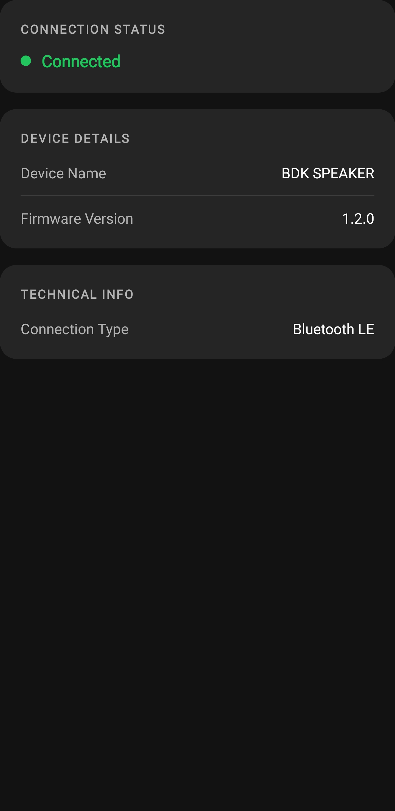

# BDK Audio App

A professional Android companion application for controlling ESP32-based Bluetooth speakers with DSP (Digital Signal Processing) capabilities and audio-reactive LED matrix effects.

## Overview

BDK Audio App provides a comprehensive control interface for managing Bluetooth Low Energy (BLE) connected ESP32 audio devices. The application enables users to adjust DSP parameters, monitor real-time audio levels, select LED visualization effects, rename the device, and perform firmware updates over-the-air.

## Screenshots

<p align="center">
  
  &nbsp;&nbsp;&nbsp;
  
  &nbsp;&nbsp;&nbsp;
  
</p>

| Main Controls | App Info | Device Info |
|:-------------:|:--------:|:-----------:|
| DSP controls, EQ sliders, codec selection, and real-time audio levels | About the app and developer info | Connection status, device name, and firmware version |

## Features

###  Bluetooth Connectivity
- BLE device scanning with service UUID filtering
- Automatic MTU negotiation (up to 517 bytes for fast OTA)
- Real-time connection status monitoring
- Switch between multiple devices
- Reads current device settings on connect (EQ, DSP toggles, LED effect)
- **Bluetooth state detection**: Auto-disconnect when Bluetooth is turned off
- **Bluetooth enable prompt**: Asks user to enable Bluetooth if disabled

###  Bluetooth Codec Selection
Change the Bluetooth audio codec directly from the app:
- **SBC** - Universal compatibility (default)
- **AAC** - Better quality for iOS devices
- **aptX** - Low latency, good quality
- **aptX HD** - High-definition audio
- **LDAC** - Highest quality (up to 990kbps)

> **Note**: Codec selection requires the speaker to be connected via Bluetooth (A2DP) first. Some devices may require Developer Options enabled.

###  DSP Control
- **Bass Boost**: Toggle hardware bass enhancement
- **Channel Flip**: Swap left/right audio channels
- **EQ Bypass**: Bypass all DSP processing
- **3-Band Equalizer**: Adjustable Bass, Mid, and Treble (-12 to +12 dB)
- Real-time audio level meters (30 Hz, 60 Hz, 100 Hz bands)

###  LED Effects (21 Modes)
Choose from 21 audio-reactive visualization effects for the 16x16 WS2812B LED matrix:

| ID | Effect | ID | Effect | ID | Effect |
|----|--------|----|---------|----|--------|
| 0 | Spectrum Bars | 7 | Starfield | 14 | Bass Reactor |
| 1 | Beat Pulse | 8 | Wave | 15 | Meteor Shower |
| 2 | Ripple | 9 | Fireworks | 16 | Breathing |
| 3 | Fire | 10 | Rainbow Wave | 17 | DNA Helix |
| 4 | Plasma | 11 | Particle Burst | 18 | Audio Scope |
| 5 | Matrix Rain | 12 | Kaleidoscope | 19 | Bouncing Balls |
| 6 | VU Meter | 13 | Frequency Spiral | 20 | Lava Lamp |

###  Device Management
- Rename your ESP32 speaker (persisted in NVS)
- View current firmware version
- Device info screen with connection details

###  Over-the-Air Firmware Updates
- Select firmware binary (.bin) from device storage
- High-speed BLE transfer using Write-No-Response
- Real-time progress bar with KB transferred
- Progress-based throttling for reliable transfers
- Automatic ESP32 reboot on completion

###  User Interface
- Modern dark theme with Material Design 3 components
- Card-based responsive layout
- Edge-to-edge display with proper inset handling
- MaterialSwitch toggles and styled spinners
- Gradient progress bars for audio meters

## Technical Specifications

### Requirements
- **Android Version**: 8.0 Oreo (API level 26) or higher
- **Target SDK**: 36 (Android 16)
- **Bluetooth**: Low Energy (BLE) support required

### Permissions
| Permission | Purpose |
|------------|---------|
| `BLUETOOTH` / `BLUETOOTH_ADMIN` | Legacy Bluetooth access (Android ≤ 11) |
| `BLUETOOTH_SCAN` | Scan for BLE devices (Android 12+) |
| `BLUETOOTH_CONNECT` | Connect to BLE devices (Android 12+) |
| `ACCESS_FINE_LOCATION` | Required for BLE scanning |

### BLE Service UUIDs
The app communicates with the ESP32 using custom GATT services:

```
Control Service:    0000xxad-0000-1000-8000-00805f9b34fb
├── Control Char:   0000xxb0-...  (DSP toggles: bass boost, flip, bypass)
├── EQ Char:        0000xxb3-...  (3-byte EQ: bass, mid, treble)
├── Name Char:      0000xxb5-...  (Device name, up to 20 chars)
├── LED Effect:     0000xxb4-...  (1-byte effect ID: 0-20)
├── FW Version:     0000xxb6-...  (Firmware version string)
├── OTA Control:    0000xxb1-...  (BEGIN:<size>, END, ABORT, PROG:<bytes>)
└── OTA Data:       0000xxb2-...  (Firmware binary chunks)

Levels Service:     0000xxab-0000-1000-8000-00805f9b34fb
└── Levels Char:    0000xxac-...  (CSV audio levels: 30Hz,60Hz,100Hz)
```

### Architecture
- **Language**: Kotlin 1.9+
- **UI Framework**: Android Views with Material Design 3
- **Bluetooth**: Native Android BLE API (BluetoothGatt)
- **Build System**: Gradle with Kotlin DSL
- **Min SDK**: 26 (Android 8.0)

## Installation

### From Source
1. Clone the repository:
   ```bash
   git clone https://github.com/WillyBilly06/BDK-AUDIO-APP.git
   ```
2. Open in Android Studio (Hedgehog or newer recommended)
3. Sync Gradle dependencies
4. Connect an Android device or start an emulator
5. Build and run (`Shift+F10`)

### APK Installation
1. Download the latest APK from the Releases page
2. Enable "Install from unknown sources" on your Android device
3. Install the APK

## Usage

1. **Connect**: Tap "Connect" to scan for ESP32 speakers
2. **Select Device**: Choose your device from the list
3. **Adjust Settings**: Use the switches and sliders to configure DSP
4. **Change LED Effect**: Select a visualization from the LED Effects dropdown
5. **Update Firmware**: Select a .bin file and tap "Start OTA"

## Project Structure

```
app/src/main/
├── java/com/example/myspeaker/
│   ├── MainActivity.kt       # Main BLE control activity
│   ├── AppInfoActivity.kt    # App version info screen
│   └── DeviceInfoActivity.kt # Device details screen
├── res/
│   ├── layout/               # XML layouts for all activities
│   ├── drawable/             # Custom button/card backgrounds
│   ├── values/               # Colors, strings, themes
│   └── mipmap-*/             # App icons (all densities)
└── AndroidManifest.xml       # App configuration & permissions
```

## Related Projects

- [ESP32 A2DP Sink with LDAC/aptX/AAC](https://github.com/WillyBilly06/esp32-a2dp-sink-with-LDAC-APTX-AAC) - The ESP32 firmware this app controls

## Developer

Created by **WillyBilly**

## License

This project is proprietary software. All rights reserved.

